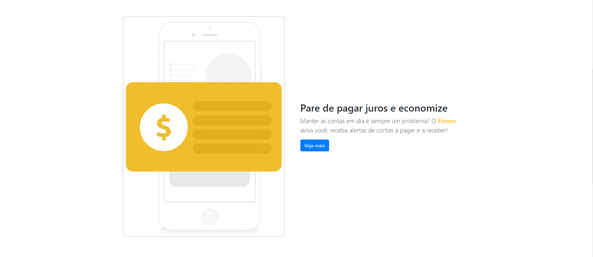

O projeto foi feito buscando aprimorar os conhecimentos em HTML5 e CSS3. O site foi construido em sua maior parte utilizando BootStrap4 e,
quando necessário, para uma melhor compatibilidade com dispositivos móveis, foi utilizado Media Queries.
 
Página Home:
 

