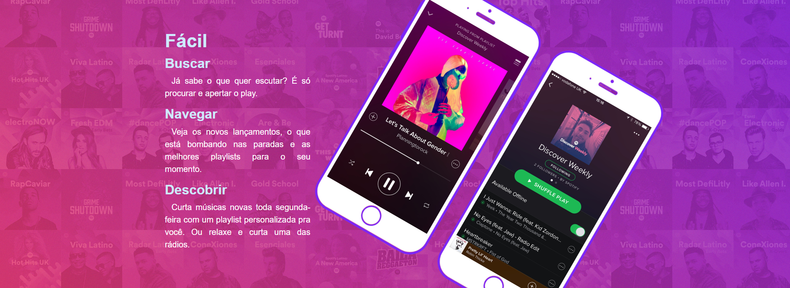

Página Home do Spotify. Foi desenvolvida com o acompanhamento do professor do curso. Além de aprender mais algumas novas propriedades do CSS3,]
também foi aplicada novas propriedades do BootStrap4. Essa página conta com alguns ajustes feitos por mim, para uma melhor aplicação aos dispositivos
móveis e, também, uma melhor experiência para o usuário. 
  
Página Spotify:
 

